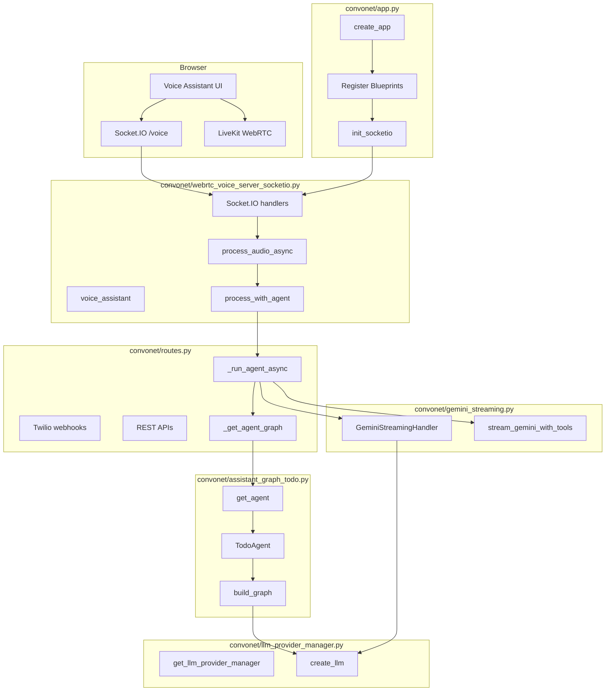

# Voice Assistant Architecture: App, Routes, WebRTC Server, Agent, LLM, Gemini

This document maps the six main components and their functions for the Convonet voice assistant (one WebRTC UI → STT → LLM → TTS).

---

## 1. High-Level Flow Diagram

```
┌─────────────────────────────────────────────────────────────────────────────────────────┐
│                                    BROWSER (1 UI)                                        │
│  Voice Assistant Page  →  Socket.IO (WSS)  →  LiveKit (WebRTC media)                      │
└─────────────────────────────────────────────────────────────────────────────────────────┘
                                              │
                                              ▼
┌─────────────────────────────────────────────────────────────────────────────────────────┐
│  app.py                                                                                  │
│  • create_app() → Flask app, SocketIO, blueprints                                        │
│  • Registers webrtc_bp, convonet_todo_bp, call_center_bp, etc.                           │
│  • init_socketio(socketio, app) → wires /voice Socket.IO handlers                        │
└─────────────────────────────────────────────────────────────────────────────────────────┘
                                              │
                    ┌─────────────────────────┼─────────────────────────┐
                    ▼                         ▼                         ▼
┌──────────────────────────┐  ┌──────────────────────────┐  ┌──────────────────────────┐
│  routes.py               │  │  webrtc_voice_server_     │  │  (other blueprints)       │
│  • Twilio webhooks       │  │  socketio.py              │  │  call_center, auth, etc. │
│  • REST APIs (token,     │  │  • /webrtc/voice-assistant│  └──────────────────────────┘
│    run_agent, providers) │  │  • Socket.IO /voice      │
│  • _get_agent_graph()    │  │  • process_audio_async   │
│  • _run_agent_async()    │  │  • process_with_agent()   │
└──────────────────────────┘  └──────────────────────────┘
                    │                         │
                    │                         │  process_with_agent() calls
                    │                         ▼
                    │            ┌──────────────────────────┐
                    └───────────►│  routes._run_agent_async │
                                 │  (orchestrates agent +   │
                                 │   Gemini vs LangGraph)   │
                                 └──────────────────────────┘
                                              │
                    ┌─────────────────────────┼─────────────────────────┐
                    ▼                         ▼                         ▼
┌──────────────────────────┐  ┌──────────────────────────┐  ┌──────────────────────────┐
│  assistant_graph_todo.py  │  │  llm_provider_manager.py  │  │  gemini_streaming.py      │
│  • get_agent()            │  │  • get_llm_provider_      │  │  • GeminiStreamingHandler │
│  • TodoAgent.build_graph()│  │    manager()             │  │  • stream_gemini_with_    │
│  • LangGraph: assistant   │  │  • create_llm()           │  │    tools()                │
│    ↔ tools (tools_condition)│  │  • get_available_        │  │  • stream_response()      │
└──────────────────────────┘  │    providers()             │  └──────────────────────────┘
                              └──────────────────────────┘
```

---

## 2. Component Diagram (Mermaid)



---

## 3. app.py — Application Bootstrap

**File:** `convonet/app.py`

| Function | Description |
|----------|-------------|
| **`generate_gravatar_url(email, size, ...)`** | Builds Gravatar URL for avatars; used by templates. |
| **`create_app()`** | Main factory: creates Flask app, loads config (`SECRET_KEY`, `DB_URI`), initializes `db`, `ckeditor`, `bootstrap`, `migrate`. Creates **SocketIO(app, cors_allowed_origins="*", async_mode='eventlet', manage_session=False)**. Registers blueprints: `convonet_todo_bp`, `auth_bp`, `team_bp`, `team_todo_bp`, `call_center_bp`, **`webrtc_bp`**, `audio_player_bp`, optional `tool_gui_bp`. Calls **`init_socketio(socketio, app)`** to attach all `/voice` Socket.IO handlers. Defines app routes: `/`, `/about`, `/convonet-tech-spec`, `/convonet-system-architecture`, `/convonet-sequence-diagram`, `/team-dashboard`, `/register`. Registers `utility_processor` (gravatar). Returns the app. |
| **`home()`** | `GET/POST /`: Renders `index.html`; on POST handles contact form (name, email, phone, message) and sends email via SMTP. |
| **`about()`** | `GET /about`: Renders about page. |
| **`convonet_tech_spec()`** | `GET /convonet-tech-spec`: Renders tech spec page. |
| **`convonet_system_architecture()`** | `GET /convonet-system-architecture`: Renders system architecture page. |
| **`convonet_sequence_diagram()`** | `GET /convonet-sequence-diagram`: Renders sequence diagram page. |
| **`team_dashboard()`** | `GET /team-dashboard`: Renders team dashboard. |
| **`register()`** | `GET /register`: Renders registration page. |

**Key point:** The **WebRTC voice** stack is registered as blueprint **`webrtc_bp`** and all real-time events are wired in **`init_socketio(socketio, app)`** (implemented in `webrtc_voice_server_socketio.py`).

---

## 4. routes.py — HTTP Routes and Agent Orchestration

**File:** `convonet/routes.py`  
**Blueprint:** `convonet_todo_bp`, prefix `/convonet_todo`

### Helpers

| Function | Description |
|----------|-------------|
| **`get_webhook_base_url()`** | Returns base URL for Twilio webhooks (`WEBHOOK_BASE_URL` or `RENDER_EXTERNAL_URL` or fallback). |
| **`get_websocket_url()`** | Returns WebSocket URL for Twilio media streams (derived from base URL with `wss://`). |

### Twilio / Voice (HTTP)

| Route / Function | Description |
|------------------|-------------|
| **`twilio_call_webhook()`** | `POST /twilio/call`. Incoming call handler: if not authenticated, returns TwiML to gather PIN (DTMF/speech); if authenticated, returns TwiML to gather speech and POST to `/twilio/process_audio`. |
| **`verify_pin_webhook()`** | `POST /twilio/verify_pin`. Validates PIN against DB, converts speech-to-digits if needed; on success returns TwiML that continues to process_audio with `user_id`. |
| **`transfer_to_agent()`** | `POST /twilio/transfer`. Legacy transfer entry. |
| **`transfer_callback()`** | `POST /twilio/transfer_callback`. Twilio transfer status callback. |
| **`voice_assistant_transfer_bridge()`** | `GET/POST /twilio/voice_assistant/transfer_bridge`. TwiML endpoint that connects the caller to a SIP URI (e.g. `sip:2001@...`) for transfer to agent. |
| **`process_audio_webhook()`** | `POST /twilio/process_audio`. Receives transcribed speech (or recording URL) from Twilio, calls **`_run_agent_async(transcribed_text, user_id=..., ...)`**, then returns TwiML with TTS or redirect. |

### Agent Graph and Run (used by WebRTC and Twilio)

| Function | Description |
|----------|-------------|
| **`_get_agent_graph(provider, user_id, agent_type, model)`** | Async. Builds or returns cached **LangGraph** for the agent: loads MCP tools, gets agent via `get_agent()` / `get_mortgage_agent()` / `get_healthcare_agent()`, calls **`agent.build_graph()`**, caches by (provider, model, agent_type). Used when **not** using Gemini streaming. |
| **`_run_agent_async(prompt, user_id, user_name, reset_thread, include_metadata, socketio, session_id, model, text_chunk_callback, tool_call_callback, metadata)`** | **Central orchestrator.** If provider is **Gemini** and SDK available: builds messages from history, calls **`stream_gemini_with_tools(...)`** from `gemini_streaming.py`, executes tools in a loop, returns final text and transfer marker. Otherwise: gets graph via **`_get_agent_graph(...)`**, runs **`agent_graph.astream(...)`**, handles tool execution and message filtering, returns response and optional transfer marker. Used by both **Twilio** (`process_audio_webhook`) and **WebRTC** (`process_with_agent` → `_run_agent_async`). |

### Other Routes (Convonet Todo, API, WebRTC)

| Route / Function | Description |
|------------------|-------------|
| **`index()`** | `GET /convonet_todo/`: Convonet Todo index. |
| **`mortgage_dashboard()`** | `GET /mortgage/dashboard`: Mortgage dashboard. |
| **`get_mortgage_applications()`** | `GET /api/mortgage/applications`: List applications. |
| **`get_mortgage_application(application_id)`** | `GET /api/mortgage/applications/<id>`: One application. |
| **`debug_suitecrm_connection()`** | `GET /debug/suitecrm-connection`: SuiteCRM debug. |
| **`clone_voice()`** | `POST /api/voice/clone`: Voice clone API. |
| **`voice_preferences()`** | `GET/POST /api/voice/preferences`: Voice preferences. |
| **`list_voices()`** | `GET /api/voice/list`: List TTS voices. |
| **`run_agent()`** | `POST /run_agent`: JSON `{prompt}`; runs **`_run_agent_async(prompt)`** sync and returns `{result}`. |
| **`websocket_route()`** | `GET /ws`: Placeholder for Twilio media WebSocket. |
| **`get_llm_providers()`** | `GET /api/llm-providers`: List LLM providers. |
| **`get_user_llm_provider()`** | `GET /api/llm-provider`: Current user LLM provider. |
| **`set_user_llm_provider()`** | `POST /api/llm-provider`: Set user LLM provider. |
| **`get_stt_providers()`** | `GET /api/stt-providers`: List STT providers. |
| **`get_user_stt_provider()`** / **`set_user_stt_provider()`** | Get/set user STT provider. |
| **`get_tts_providers()`** | `GET /api/tts-providers`: List TTS providers. |
| **`get_user_tts_provider()`** / **`set_user_tts_provider()`** | Get/set user TTS provider. |
| **`get_pending_response()`** | `GET /webrtc/pending-response`: Pending response for polling. |
| **`whisper_status()`** | `GET /webrtc/whisper-status`: Whisper status. |

**Key point:** **`_run_agent_async`** is the single place that either uses **Gemini streaming** (`stream_gemini_with_tools`) or **LangGraph** (`_get_agent_graph` + `astream`). Both paths use **`llm_provider_manager`** when building the LangGraph agent (for Claude/OpenAI and for Gemini non-streaming).

---

## 5. webrtc_voice_server_socketio.py — WebRTC Voice Pipeline

**File:** `convonet/webrtc_voice_server_socketio.py`  
**Blueprint:** `webrtc_bp` (registered in app.py)

### HTTP Routes

| Function | Description |
|----------|-------------|
| **`voice_assistant()`** | Serves the WebRTC voice assistant page (template with Socket.IO and LiveKit client). |
| **`livekit_client_js()`** | Serves LiveKit client JS (or CDN URL). |
| **`livekit_debug()`** | Debug endpoint for LiveKit. |

### Helpers (selection)

| Function | Description |
|----------|-------------|
| **`get_deepgram_tts_service()`** | Returns Deepgram TTS service singleton. |
| **`_strip_markdown_for_tts(text)`** | Strips markdown for TTS. |
| **`_synthesize_audio_linear16(text, provider, voice_id, sample_rate)`** | Dispatches TTS to Deepgram/Cartesia/ElevenLabs; returns linear16 PCM. |
| **`_synthesize_deepgram_linear16(...)`** | Deepgram TTS → linear16. |
| **`_encode_linear16_wav_base64(...)`** | Wraps PCM in WAV header and base64. |
| **`resample_audio(...)`** | Resamples audio (e.g. 48k→16k for AssemblyAI). |
| **`_livekit_active()`** / **`_livekit_input_active()`** | Whether LiveKit is enabled and used for input. |
| **`_get_livekit_info(session_id, user_id)`** | Returns LiveKit token/URL/room name for the client. |
| **`_ensure_livekit_session(session_id, user_id)`** | Ensures a LiveKit room exists for the session. |
| **`_send_livekit_pcm(session_id, pcm_bytes, ...)`** | Sends PCM to LiveKit room (playback to user). |
| **`_get_llm_provider_for_user(user_id)`** / **`_get_stt_provider_for_user(user_id)`** / **`_get_tts_provider_for_user(user_id)`** | Resolve provider from Redis/user prefs (defaults: deepgram, claude/gemini, deepgram). |
| **`_select_voice_model(user_id)`** | Chooses faster model for voice (e.g. Haiku). |
| **`warmup_llm_model()`** | One-off warmup call to `_run_agent_async` (e.g. "Warm up. Reply with OK."). |
| **`register_active_response(session_id, cancel_event, tts_stream)`** / **`cancel_active_response(session_id, reason)`** | Track and cancel in-progress response (e.g. barge-in). |
| **`build_customer_profile_from_session(session_data)`** | Builds customer profile dict from session for call center. |
| **`cache_call_center_profile(extension, session_data, call_sid, call_id)`** | Caches profile in Redis for call center popup. |
| **`initiate_agent_transfer(session_id, extension, department, reason, session_data)`** | Calls Twilio to create outbound call to SIP extension; caches profile. |

### Socket.IO Namespace `/voice`

| Event (handler) | Description |
|------------------|-------------|
| **`connect`** | On connect: init session in Redis (or in-memory), emit `session_id`. |
| **`disconnect`** | On disconnect: cleanup session, leave room, stop streaming STT. |
| **`authenticate`** | Payload: PIN or credentials. Validates against DB, updates session (user_id, user_name), join_room(session_id). |
| **`get_livekit_info`** | Returns LiveKit token/URL/room for the client. |
| **`client_ready`** | Client ready: optional LiveKit URL override, emit livekit_info. |
| **`livekit_client_state`** | Receives client LiveKit state (e.g. connected). |
| **`stop_audio`** | Cancels current playback (barge-in). |
| **`start_recording`** | Starts recording: if LiveKit, pipes LiveKit audio into **StreamingSTTSession**; else expects `audio_data` chunks. Starts **StreamingSTTSession** for Deepgram streaming STT; on final transcript calls **process_audio_async(session_id, None, transcribed_text_override=final_text, ...)**. |
| **`audio_data`** | Receives base64 audio chunks (when not using LiveKit); enqueues to streaming STT or batch buffer. |
| **`stop_recording`** | Stops recording, flushes buffer, triggers **process_audio_async(session_id, audio_buffer, ...)**. |

### Core Processing

| Function | Description |
|----------|-------------|
| **`process_audio_async(session_id, audio_buffer, transcribed_text_override, use_streaming_tts)`** | **Main voice pipeline.** 1) Get session from Redis. 2) If no `transcribed_text_override`, run STT (Deepgram/Cartesia/AssemblyAI/Modulate) on `audio_buffer`. 3) Emit `transcription` to client. 4) If user said "stop", cancel playback and return. 5) If **transfer intent**: call **start_transfer_flow(...)** (cache profile, **initiate_agent_transfer**, emit transfer events, play TTS "transferring..."). 6) Else: run **process_with_agent** in background (via **AgentProcessor** and async loop), optionally start **early TTS** on first sentence; wait for agent result; if transfer marker, **start_transfer_flow**; else run full TTS (streaming or chunked) and send audio via LiveKit or Socket.IO `agent_response` / `audio_chunk`. |
| **`process_with_agent(text, user_id, user_name, socketio, session_id, text_chunk_callback, tool_call_callback, latency_data)`** | **Async.** Calls **`routes._run_agent_async(prompt=text, user_id=..., socketio=socketio, session_id=session_id, model=voice_model, ...)`**. Returns `(response_text, transfer_marker)`. |

### Classes

| Class | Description |
|-------|-------------|
| **`StreamingTTSStream`** | Streams TTS chunks to the client (Socket.IO or LiveKit). |
| **`StreamingSTTSession`** | Holds Deepgram streaming STT connection; consumes audio from queue, sends to Deepgram, invokes `on_final_transcript` / `on_partial_transcript` / `on_user_speech`. |
| **`AgentProcessor`** | Holds a long-lived asyncio event loop and **run_coro(coro)** to run async tasks (e.g. **process_with_agent**) from the Socket.IO/eventlet context. |

### Initialization

| Function | Description |
|----------|-------------|
| **`init_socketio(socketio_instance, app)`** | Saves socketio and app as globals; initializes **LiveKitSessionManager** if enabled; starts LiveKit idle checker; **registers all `@socketio.on(...)` handlers for namespace `/voice`** (connect, disconnect, authenticate, get_livekit_info, client_ready, livekit_client_state, stop_audio, start_recording, audio_data, stop_recording). |

**Key point:** The browser talks to **this** module over **Socket.IO `/voice`** and (optionally) **LiveKit**. All STT/TTS and transfer logic lives here; the actual **LLM/agent** call is delegated to **`process_with_agent`** → **`routes._run_agent_async`**.

---

## 6. assistant_graph_todo.py — LangGraph Agent

**File:** `convonet/assistant_graph_todo.py`

### Agent Classes

| Class | Description |
|-------|-------------|
| **`TodoAgent`** | Default productivity agent: system prompt (todos, reminders, calendar, team, MCP tools, transfer_to_agent). **`__init__(name, model, provider, tools, system_prompt)`**: sets LLM via **`llm_provider_manager.create_llm(provider, model, tools=tools)`**. **`build_graph(self)`**: builds **StateGraph(AgentState)** with node **"assistant"** (calls **assistant(state)**) and node **"tools"** (tools_node); **set_entry_point("assistant")**; **add_conditional_edges("assistant", tools_condition)**; **add_edge("tools", "assistant")**; returns **builder.compile(checkpointer=InMemorySaver())**. **`assistant(state)`**: filters messages (tool_use/tool_result pairing), invokes **self.llm.ainvoke([SystemMessage(...)] + filtered_messages)**, handles tool_calls and transfer marker; returns new state. **tools_node** runs tools and appends ToolMessages. |
| **`MortgageAgent(TodoAgent)`** | Same as TodoAgent but mortgage prompt and tools. |
| **`HealthcareAgent(TodoAgent)`** | Same as TodoAgent but healthcare payer prompt and tools. |

### Functions

| Function | Description |
|----------|-------------|
| **`get_agent()`** | Lazy singleton: returns **TodoAgent()** (default productivity agent). |
| **`get_mortgage_agent(tools, provider, model)`** | Returns **MortgageAgent(...)**. |
| **`get_healthcare_agent(tools, provider, model)`** | Returns **HealthcareAgent(...)**. |

**Key point:** **`_get_agent_graph()`** in routes uses **get_agent()** / **get_mortgage_agent()** / **get_healthcare_agent()** and then **agent.build_graph()** to get the compiled LangGraph. The **LLM** inside the agent is created by **llm_provider_manager.create_llm()**.

---

## 7. llm_provider_manager.py — LLM Provider Abstraction

**File:** `convonet/llm_provider_manager.py`

| Function | Description |
|----------|-------------|
| **`_initialize_providers()`** | Registers **claude** (ChatAnthropic), **gemini** (ChatGoogleGenerativeAI), **openai** (ChatOpenAI); sets env vars (e.g. ANTHROPIC_API_KEY, GOOGLE_API_KEY) and **available** flag. |
| **`get_available_providers()`** | Returns list of `{id, name, available}`. |
| **`create_llm(provider, model, temperature, tools)`** | Instantiates the LangChain model for **claude** / **gemini** / **openai**; for **gemini** optionally **bind_tools(tools)** with timeout; returns **BaseChatModel**. |
| **`get_default_provider()`** | First available provider id. |
| **`is_provider_available(provider)`** | Whether that provider is available. |
| **`get_llm_provider_manager()`** | Global singleton **LLMProviderManager** instance. |

**Key point:** **assistant_graph_todo** uses **get_llm_provider_manager().create_llm(provider, model, tools=tools)** when building the agent. **Gemini streaming** uses the same provider/config but calls the **Gemini SDK** directly from **gemini_streaming.py**, not LangChain.

---

## 8. gemini_streaming.py — Gemini Native Streaming

**File:** `convonet/gemini_streaming.py`

### Class: GeminiStreamingHandler

| Method / role | Description |
|----------------|-------------|
| **`__init__(api_key, model, tools, system_prompt, on_text_chunk, on_tool_call, on_complete)`** | Stores config; reuses global **genai.Client(api_key)**. |
| **`_resolve_schema_refs(schema, defs)`** | Resolves JSON Schema `$ref` / `anyOf` for Gemini function declarations. |
| **`_convert_tools_to_gemini_format()`** | Converts LangChain tools to Gemini function declarations (name, description, parameters). |
| **`stream_response(messages, session_id)`** | **Async.** Converts LangChain messages to Gemini SDK format; calls **generate_content_stream** (or equivalent) with **system_instruction** and tools; streams text via **on_text_chunk**; parses tool calls and appends to list; returns **(full_text, tool_calls)**. |
| **`stream_response` (internal)** | Handles **content** and **function_call** parts; executes tools and appends **ToolMessage**-like content; re-streams until no more tool calls. |

### Module-Level Function

| Function | Description |
|----------|-------------|
| **`stream_gemini_with_tools(prompt, api_key, model, tools, system_prompt, messages, socketio, session_id)`** | **Async.** Builds **GeminiStreamingHandler** with **on_text_chunk** (append + emit **agent_stream_chunk**), **on_tool_call** (append + emit). Loop: **handler.stream_response(messages)** → if tool_calls, execute each tool, append ToolMessage to **conversation_messages**, repeat; else break. Returns **(final_text, tool_calls_list)**. Used by **routes._run_agent_async** when provider is **gemini** and **GEMINI_SDK_AVAILABLE**. |

**Key point:** When the user’s LLM provider is **Gemini**, **`_run_agent_async`** uses **stream_gemini_with_tools** instead of the LangGraph path. Tool execution (and transfer handling) is done inside this loop; the rest of the voice pipeline (TTS, transfer flow) is unchanged and still driven by **webrtc_voice_server_socketio** and **routes**.

---

## 9. End-to-End Call Summary

1. **Browser** loads the voice assistant page (from **webrtc_bp**), connects to **Socket.IO** `/voice` and optionally **LiveKit**.
2. **app.py** has already registered **webrtc_bp** and called **init_socketio** so all **webrtc_voice_server_socketio** Socket.IO handlers are active.
3. User speaks → **start_recording** / **audio_data** (or LiveKit) → **StreamingSTTSession** or batch buffer → STT (Deepgram etc.) → **process_audio_async**.
4. **process_audio_async** either handles transfer (STT → **start_transfer_flow** → **initiate_agent_transfer**) or calls **process_with_agent**.
5. **process_with_agent** calls **routes._run_agent_async** with the transcribed text and session info.
6. **routes._run_agent_async** either:
   - **Gemini:** **stream_gemini_with_tools** (gemini_streaming) → tools executed in loop → final text and transfer marker; or
   - **Claude/OpenAI:** **_get_agent_graph** → **get_agent()** / get_mortgage_agent / get_healthcare_agent → **agent.build_graph()** (uses **llm_provider_manager.create_llm**) → **graph.astream** → tool execution inside graph → final text and transfer marker.
7. Result and optional transfer marker go back to **process_audio_async** → TTS (Deepgram/Cartesia/ElevenLabs) → audio sent to client via **LiveKit** or Socket.IO **agent_response** / **audio_chunk**.

This document and the diagrams above describe how **app.py**, **routes.py**, **webrtc_voice_server_socketio.py**, **assistant_graph_todo.py**, **llm_provider_manager.py**, and **gemini_streaming.py** fit together and their main functions.

---

## 10. FastAPI + GCP Reference Architecture (Future Direction)

This section sketches how the current Flask + Flask-SocketIO architecture can evolve into a **FastAPI + asyncio** design deployed on **Google Cloud Run**, keeping the same business logic (STT/LLM/TTS, agents, SuiteCRM) but changing the web layer and deployment model.

### 10.1 Services on GCP

- **`voice-gateway-service` (Cloud Run, FastAPI)**  
  - Replaces Socket.IO `/voice` with **FastAPI WebSockets** (or Socket.IO on ASGI).  
  - Handles:
    - WebRTC/browser WebSocket endpoint (`/webrtc/ws`).  
    - Twilio webhooks (`/twilio/call`, `/twilio/verify_pin`, `/twilio/process_audio`, `/twilio/voice_assistant/transfer_bridge`).  
    - STT orchestration (Deepgram/Cartesia/AssemblyAI/Modulate).  
    - TTS orchestration (Deepgram/Cartesia/ElevenLabs/Rime/Inworld).  
    - Transfer to FusionPBX (Twilio SIP).  
  - Reuses logic from `convonet/webrtc_voice_server_socketio.py` and `convonet/routes.py`, refactored into pure-async functions (no Flask/SocketIO).

- **`agent-llm-service` (Cloud Run, FastAPI)**  
  - Exposes an async HTTP endpoint `/agent/process` that wraps the current `_run_agent_async` behavior.  
  - Internals:
    - For Gemini: calls `stream_gemini_with_tools(...)` from `convonet/gemini_streaming.py`.  
    - For Claude/OpenAI: builds/uses LangGraph via `assistant_graph_todo.py` and `llm_provider_manager.py`.  
  - Returns JSON `{response: str, transfer_marker: Optional[str]}` to `voice-gateway-service`.

- **`call-center-service` (Cloud Run, FastAPI)**  
  - Ports `call_center/routes.py` to FastAPI:  
    - `GET /call-center` for the JsSIP-based call center UI.  
    - `/api/agent/login`, `/api/customer`, etc. as async JSON endpoints.  
  - Uses the same SQLAlchemy models and `call_center/security.py` helpers, but under FastAPI.

- **`crm-integration-service` (Cloud Run, FastAPI)**  
  - Thin FastAPI wrapper around `convonet/services/suitecrm_client.py`.  
  - Provides a stable internal API for creating SuiteCRM contacts/cases/appointments from any other service.

Shared infrastructure:

- **FusionPBX VM (GCE)**: unchanged, still handles SIP/WebRTC for agents.  
- **SuiteCRM VM (GCE)**: unchanged, still stores CRM data.  
- **Cloud SQL (Postgres)**: replaces the current DB URI host when moving off Render.  
- **MemoryStore (Redis)**: replaces or mirrors the current Redis usage from `convonet/redis_manager.py`.  
- **Cloud HTTP(S) Load Balancer**: routes `/webrtc/*` and `/twilio/*` to `voice-gateway-service`, `/call-center/*` to `call-center-service`, `/agent/*` to `agent-llm-service`, `/crm/*` to `crm-integration-service`.

### 10.2 FastAPI WebSocket Message Schemas (voice-gateway-service)

The FastAPI WebSocket endpoint (e.g. `@router.websocket("/ws")`) can use a simple JSON message protocol. Below are **Pydantic models** you can use as a starting point.

#### 10.2.1 Client → Server messages

```python
from enum import Enum
from typing import Optional, List
from pydantic import BaseModel, Field


class ClientMessageType(str, Enum):
    AUTHENTICATE = "authenticate"
    START_RECORDING = "start_recording"
    AUDIO_CHUNK = "audio_chunk"
    STOP_RECORDING = "stop_recording"
    TRANSFER_REQUEST = "transfer_request"
    HEARTBEAT = "heartbeat"


class AuthMessage(BaseModel):
    type: ClientMessageType = Field(ClientMessageType.AUTHENTICATE, const=True)
    session_id: Optional[str] = None
    pin: Optional[str] = None
    user_token: Optional[str] = None  # future JWT/OAuth support


class StartRecordingMessage(BaseModel):
    type: ClientMessageType = Field(ClientMessageType.START_RECORDING, const=True)
    session_id: str
    stt_mode: str = "streaming"  # or "batch"
    language: str = "en-US"


class AudioChunkMessage(BaseModel):
    type: ClientMessageType = Field(ClientMessageType.AUDIO_CHUNK, const=True)
    session_id: str
    sequence: int
    timestamp_ms: int
    data_b64: str  # base64-encoded audio chunk (e.g. 16-bit PCM or WebM/Opus)


class StopRecordingMessage(BaseModel):
    type: ClientMessageType = Field(ClientMessageType.STOP_RECORDING, const=True)
    session_id: str


class TransferRequestMessage(BaseModel):
    type: ClientMessageType = Field(ClientMessageType.TRANSFER_REQUEST, const=True)
    session_id: str
    extension: str = "2001"
    department: str = "support"
    reason: Optional[str] = "User requested human agent"


class HeartbeatMessage(BaseModel):
    type: ClientMessageType = Field(ClientMessageType.HEARTBEAT, const=True)
    session_id: str
    ts_ms: int
```

You can parse incoming JSON in the WebSocket handler using a small dispatcher that inspects `message["type"]` and then validates with the corresponding model.

#### 10.2.2 Server → Client messages

```python
class ServerMessageType(str, Enum):
    AUTH_OK = "auth_ok"
    AUTH_FAILED = "auth_failed"
    STATUS = "status"
    TRANSCRIPT_PARTIAL = "transcript_partial"
    TRANSCRIPT_FINAL = "transcript_final"
    AGENT_STREAM_CHUNK = "agent_stream_chunk"
    AGENT_FINAL = "agent_final"
    AUDIO_CHUNK = "audio_chunk"
    TRANSFER_INITIATED = "transfer_initiated"
    TRANSFER_STATUS = "transfer_status"
    ERROR = "error"


class AuthOkMessage(BaseModel):
    type: ServerMessageType = Field(ServerMessageType.AUTH_OK, const=True)
    session_id: str
    user_id: Optional[str] = None
    user_name: Optional[str] = None


class StatusMessage(BaseModel):
    type: ServerMessageType = Field(ServerMessageType.STATUS, const=True)
    session_id: str
    message: str


class TranscriptPartialMessage(BaseModel):
    type: ServerMessageType = Field(ServerMessageType.TRANSCRIPT_PARTIAL, const=True)
    session_id: str
    text: str
    is_final: bool = False


class TranscriptFinalMessage(BaseModel):
    type: ServerMessageType = Field(ServerMessageType.TRANSCRIPT_FINAL, const=True)
    session_id: str
    text: str
    sequence: Optional[int] = None


class AgentStreamChunkMessage(BaseModel):
    type: ServerMessageType = Field(ServerMessageType.AGENT_STREAM_CHUNK, const=True)
    session_id: str
    text_chunk: str
    is_final: bool = False


class AgentFinalMessage(BaseModel):
    type: ServerMessageType = Field(ServerMessageType.AGENT_FINAL, const=True)
    session_id: str
    text: str
    transfer_marker: Optional[str] = None


class AudioChunkOutMessage(BaseModel):
    type: ServerMessageType = Field(ServerMessageType.AUDIO_CHUNK, const=True)
    session_id: str
    chunk_index: int
    total_chunks: Optional[int] = None
    data_b64: str
    is_final: bool = False
    is_early: bool = False  # for early TTS of first sentence


class TransferInitiatedMessage(BaseModel):
    type: ServerMessageType = Field(ServerMessageType.TRANSFER_INITIATED, const=True)
    session_id: str
    extension: str
    department: str
    reason: str


class TransferStatusMessage(BaseModel):
    type: ServerMessageType = Field(ServerMessageType.TRANSFER_STATUS, const=True)
    session_id: str
    success: bool
    details: dict


class ErrorMessage(BaseModel):
    type: ServerMessageType = Field(ServerMessageType.ERROR, const=True)
    session_id: Optional[str] = None
    message: str
    code: Optional[str] = None
```

In the FastAPI WebSocket handler you can build and send messages as:

```python
await websocket.send_json(TranscriptFinalMessage(
    session_id=session_id,
    text=final_text,
    sequence=sequence_id,
).model_dump())
```

These schemas give you:

- Explicit `type` fields (easy client dispatch).  
- Built-in **timestamps and sequence numbers** on audio/STS events.  
- A clean separation between **client→server control** and **server→client status/streaming** messages, ready for an asyncio-based `voice-gateway-service` on GCP.
